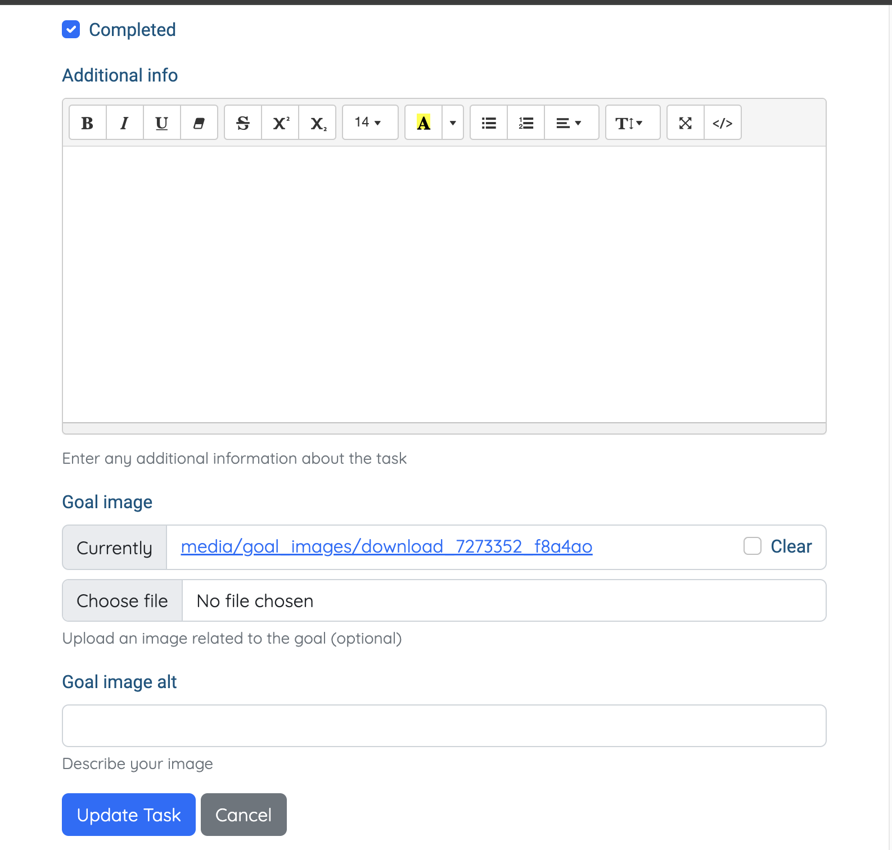
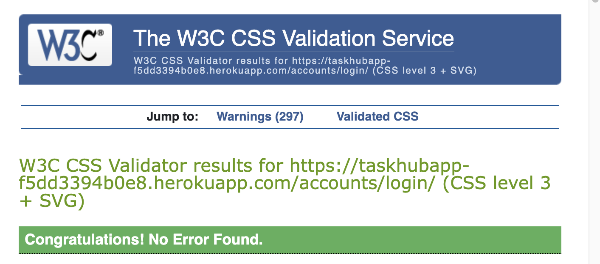

# TaskHub

TaskHub is a versatile task management application designed to enhance productivity. The app is targeted towards individuals who may find it hard to manage their tasks. It provides an interface for recording tasks, adding additional details that might be necessary for achieving a task, and setting a goal that the user can work towards.
admin username: manager
password: taskhubmanager

The live link to the MVP website is on here- [TaksHub](https://taskhubapp-f5dd3394b0e8.herokuapp.com/)

---
## Content Page

1. [User Experience](#user-experience)
2. [Epics](#epics)
3. [Website Design](#website-design)
    - [Agile Methodology](#agile-methodology)
    - [Data Modeling](#data-modeling)
4. [Features](#features)
5. [Development and Deployment](#development-and-deployment)
    - [Installation](#installation)
    - [Deployment to Heroku](#deployment-to-heroku)
6. [Technologies](#technologies)
    - [Languages](#languages)
    - [Frameworks - Libraries and Requirements](#frameworks---libraries-and-requirements)
    - [Requirements.txt](#requirements.txt)
7. [Testing and Validation](#testing-and-validation)
    - [User Authentication](#user-authentication)
    - [HTML Validation](#html-validation)
    - [CSS Validation](#css-validation)
    - [Python Validation](#python-validation)
    - [Lighthouse Validation](#lighthouse-validation)
    - [Browser and Device Testing](#browser-and-device-testing)
    - [Manual Testing](#manual-testing)
8. [Bugs and Debugging](#bugs-and-debugging)
9. [Acknowledgements](#acknowledgements)
10. [Credit](#credit)

---


## User Experience
A regular or new user will be someone who is interested in task management. They want a comprehensive and easily navigable website to track their activities.

### As a User

1. **User Registration**: Create an account to unlock access to TaskHub.
2. **User Login**: Log in to your account to manage your tasks efficiently.
3. **Create Task**: Add tasks to your to-do list effortlessly for better task management.
4. **Update Task**: Keep task details current by updating them as needed.
5. **Delete Task**: Remove irrelevant tasks to maintain a clutter-free list.
6. **Categorize Tasks**: Organize tasks into categories to streamline workflow.
7. **Filter Tasks**: Find specific tasks easily by applying filters based on various criteria.
8. **Search Tasks**: Quickly locate tasks by searching their names.

---

## Epics

### User Management

- **User Registration**: Allow users to register securely to access TaskHub.
- **User Login and Logout**: Enable seamless user authentication for accessing tasks.

### Task Management

- **Task CRUD Operations**: Provide functionalities for creating, reading, updating, and deleting tasks.
- **Task Categorization**: Enable users to categorize tasks for better organisation.
- **Task Filtering**: Allow users to filter tasks based on various criteria for efficient task tracking.

### Error Handling

- **Custom Error Pages**: Enhance user experience with custom error pages tailored to different HTTP status codes.

---

## Website Design
**Agile Methodology**
This methodology was implemented to develop an iterative and tracked process of website development. Detailings that expand on the UX epics can be found in this [link](https://github.com/users/JonFD4/projects/3)

### Data modelling
#### Data Modeling Description

The TaskHub application employs a relational database model to manage tasks and categories. Thus providing users with an organised way to track their tasks efficiently. The data model consists of two main entities: **Category** and **Task**.

### Category Entity

The **Category** entity represents different groups or types of tasks. Each category has the following attributes:

- **ID (Primary Key):** A unique identifier for each category.
- **Name:** The name of the category, which helps users distinguish between different types of tasks (e.g., Work, Personal, leisure, etc.).
- **Description:** This is an optional field for users to provide additional context or details about the category.
- **User ID (Foreign Key):** A reference to the user who created the category.

Categories help users organize their tasks into meaningful groups, making it easier to manage and prioritize their tasks effectively.

### Task Entity

The **Task** entity represents individual tasks that users need to track, complete, or manage. Each task has the following attributes:

- **ID (Primary Key):** A unique identifier for each task.
- **Title:** The title or name of the task.
- **Due Date:** The deadline or target date by which the task should be completed.
- **Due Time:** An optional field specifying the due time for the task.
- **Category ID (Foreign Key):** A reference to the category to which the task belongs.
- **Priority:** Indicates the priority level of the task (High, Medium, Low).
- **Completion Status:** A boolean field indicating whether the task has been completed or not.
- **Additional Information:** An optional field for users to provide additional details or notes about the task.
- **Goal Image:** An optional image related to the task's goal, providing visual context or inspiration.
- **Goal Image Alt:** A brief description or alternative text for the goal image, aiding accessibility.

Tasks are associated with specific categories, allowing users to categorise and group related tasks together. Users can create, update, delete, and mark tasks as completed or incomplete, enabling efficient task management and organization.

### User Entity

The **User** entity represents individuals who use the TaskHub application. Each user has a unique identifier (ID) and other attributes such as username, email, and password. Users can create multiple categories and tasks, allowing them to customise their task management experience according to their preferences and needs.


---

## Features
### Header


* It has the logo designed using svg. The logo is linked to the home page wherever it is present.
* Nav bar is exposed when the button is clicked on
   - The dropdown reveals, login, register for an unauthorised user. However, if it is registered user, it shows, dashboard, category list, add task, log out.
   - When user is logged in, at the center of the navbar, the username along with a person icon appears.

### Footer

* The footer includes the logo, contact details as well as links to social media pages.
   - By clicking on the social media links, the user is navigated to the chosen site on a new tab.

### Home page


The home page features CTA that says '''Get Started'''. The button directs user to the sign in page. When user is logged in that button is disabled.

### User Account page

* sign up


* sign in


* Sign out

These three pages were derived from django-allauth and customised using bootstrap5.

### Task dashboard page


* This page shows all task created by the user.
* It provides filter and search functionalities.
* When a task is clicked, the user is directed to task details where they can choose whether to update or delete a task.

### Task details page

* When user clicks on the `update button`, the redirected to the update page.
* When user clicks on `delete button`, a modal is triggered that asks for deletion confirmation.

### Create and update task
The create and update task fields are similar in their presentation. The difference lies in the title and the fact that the update_task page appears with pre-filled detailas and the create_task page does not.




* Both folders provide user the ability to give a title, due date, due time, category, priority, completed checkbox, additional info, goal image.
* If user clicks on update task or create task, their input will be saved in the database. If they choose to cancel, it will be discarded.
---
### Category dashboard

The page consists of:
- Create category button that directs user to create-category page.
- The option for deleting or updating the category.
- If the user clicks on update, they are redirected to a pre-filled page for them to update content.
- If user clicks on delete, a modal is triggered requesting for user to confirm deletion.

### Category Update and Create

The pages for which these two functions where designed are similar.
Where the update_category page is prefilled, the create_category is not.
- The user is provide with option to either create/update depending on which oage they are on or to cancel.

## Error handling page


## Development and Deployment
<details>
<summary><strong>Installation</strong></summary>

### Prerequisites

- Python 3.x
- Django 3.x
- PostgreSQL (for production)
- SQLite (for development)
- Git
- Heroku CLI

### Steps to cloning repo

1. **Clone the repository**

    ```bash
    git clone https://github.com/JonFD4/Taskhub.git
    cd taskhub
    ```

2. **Create and activate a virtual environment**

    ```bash
    python -m venv venv
    source venv/bin/activate   # On Windows use `venv\Scripts\activate`
    ```

3. **Install dependencies**

    ```bash
    pip install -r requirements.txt
    ```

4. **Apply migrations**

    ```bash
    python manage.py migrate
    ```

5. **Create a superuser**

    ```bash
    python manage.py createsuperuser
    ```

6. **Run the development server**

    ```bash
    python manage.py runserver
    ```

## Deploy to Heroku
1. log in to Heroku and create an account
2. Click on `New` in the top right. A dropdown button will appear. Click `Create New App`.
3. Enter a unique app name.
4. Select your region
5. Then `Create App`

### Configuring Settings.py and env.py

1. **Create `env.py` File**:
   - In the main directory, create `env.py`.
   - Add your `SECRET_KEY`, `DATABASE_URL`, and `CLOUDINARY_URL` values.

2. **Update `settings.py`**:
   - Import `env.py` and `os` libraries.
   - Set `SECRET_KEY` and `DATABASE_URL` using environment variables from `env.py`.
   - Set `DEBUG` to `True` for development.
   - Add your Heroku app to `ALLOWED_HOSTS`.

3. **Installed Apps**:
   - Include necessary apps like `cloudinary_storage`, `allauth`, `crispy_forms`, and your custom apps.

4. **Middleware**:
   - Ensure necessary middleware including security, session, authentication, and Allauth middleware.

5. **Templates Directory**:
   - Define `TEMPLATES_DIR` and update the templates configuration to include this directory.

6. **Authentication Backends**:
   - Include Django's default and Allauth authentication backends.

7. **Database Configuration**:
   - Comment out the default SQLite configuration.
   - Use the `DATABASE_URL` from `env.py` for database configuration.

8. **Static Files and Cloudinary Configuration**:
   - Configure `STATIC_URL`, `STATICFILES_STORAGE`, `STATICFILES_DIRS`, and `STATIC_ROOT`.
   - Configure `MEDIA_URL` and `MEDIA_ROOT`.
   - Set `DEFAULT_FILE_STORAGE` to use Cloudinary.

9. **Other Settings**:
   - Define URLs for login and redirect after login/logout.
   - Add Heroku and other domains to `CSRF_TRUSTED_ORIGINS`.
   - Set `LANGUAGE_CODE`, `TIME_ZONE`, `USE_I18N`, `USE_L10N`, and `USE_TZ`.
   - Set `DEFAULT_AUTO_FIELD`.

10. **Make Migrations**:
    - Save changes and run `python manage.py makemigrations` and `python manage.py migrate` to apply migrations.

### Setting requirements for deployment
1. **Create `requirements.txt`**:
   - List all required Python packages for your project.

2. **Create Directories**:
   - Create `media`, `storage`, and `templates` directories in the main project directory.

3. **Create `Procfile`**:
   - Create a `Procfile` in the main directory with the command to run your project using Gunicorn.


### Update Heroku Config Vars

1. **Access Heroku Dashboard**:
   - Log in to your Heroku account.
   - Navigate to your app’s dashboard.

2. **Set Config Vars**:
   - Go to the "Settings" tab.
   - Click on "Reveal Config Vars".
   - Add the following Config Vars:
     - `SECRET_KEY` = `yoursecretkey`
     - `CLOUDINARY_URL` = `yourcloudinaryurl`
     - `PORT` = `8000`
     - `DISABLE_COLLECTSTATIC` = `1`

### Ensure Django Settings

1. **Set `DEBUG` to `False`**:
   - In your `settings.py` file, set:
     ```python
     DEBUG = False
     ```

### Deploy on Heroku

1. **Connect to GitHub**:
   - Go to the "Deploy" tab on your Heroku dashboard.
   - Connect to GitHub if you haven’t already.
   - Search for and connect to your required repository.

2. **Deploy Methods**:
   - **Automatic Deploys**:
     - Scroll to the "Automatic Deploys" section.
     - Click "Enable Automatic Deploys".
   - **Manual Deploys**:
     - Scroll to the "Manual Deploy" section.
     - Select the branch you want to deploy.
     - Click "Deploy Branch".

3. **View Your Deployed Site**:
   - Once the deployment process is done, click "View" to see your live site.
</details>

<details>
<summary><strong>Technologies</strong></summary>

<strong>Languages</strong>
- **Python**
- **HTML**
- **CSS**
- **JavaScript**


<strong>Frameworks - Libraries and Requirements</strong>

- **AmIResponsive?**: Checks TaskHub's responsiveness across devices.
- **Bootstrap 5**: Provides styling components for TaskHub.
- **CI Python Linter**: Validates Python code for quality.
- **Chrome Dev Tools**: Assists in development and testing.
- **Crispy Forms**: Simplifies form management in TaskHub.
- **Django**: The main framework for TaskHub, providing scalability.
- **Django-allauth**: Handles user authentication securely.
- **Favicon**: Creates TaskHub's browser icon.
- **GitHub**: Manages TaskHub's code and enables collaboration.
- **Google Fonts**: Adds custom fonts to TaskHub's design.
- **Heroku**: Hosts TaskHub online, ensuring scalability.
- **PostgreSQL**: Stores TaskHub's data efficiently.
- **Summernote**: Allows easy text editing in TaskHub.
- **W3C**: Ensures TaskHub meets web standards.

<strong>Requirements.txt</strong>
```requirements.txt
asgiref==3.8.1
bleach==6.1.0
certifi==2024.2.2
charset-normalizer==3.3.2
cloudinary==1.40.0
crispy-bootstrap5==2024.2
dj-database-url==2.1.0
dj3-cloudinary-storage==0.0.6
Django==5.0.6
django-allauth==0.63.1
django-cloudinary-storage==0.3.0
django-crispy-forms==2.1
django-resized==1.0.2
django-richtextfield==1.6.2
django-summernote==0.8.20.0
gunicorn==22.0.0
idna==3.7
packaging==24.0
pillow==10.3.0
psycopg2==2.9.9
pytz==2024.1
requests==2.31.0
six==1.16.0
sqlparse==0.5.0
typing_extensions==4.11.0
urllib3==2.2.1
webencodings==0.5.1
```
</details>

---

## Testing and Validation
<details>
<summary>User Authentication</summary>


- **LoginRequiredMixin**: Ensures that only authenticated users can access certain pages. If a non-authenticated user attempts to access these pages, they are redirected to the login page.

### Form Validation

- Forms are validated to ensure all required fields are filled correctly. If any field is incorrect or empty, the form submission fails, and an error message is displayed to the user, indicating which field caused the error.

### Database Security

- **Environment Variables**: The database URL and secret key are stored in the `env.py` file. This prevents unauthorized access to the database. Ensure to place env.py in gitignore. 
- **CSRF Protection**: Cross-Site Request Forgery (CSRF) tokens are used on all forms to enhance security.

### Custom Error Pages

Customised error pages provide users with detailed information about errors and include navigation buttons to help them return to the site.

- **400 Bad Request**: ">Taskhub server could not understand the request due to invalid syntax ."
- **403 Page Forbidden**: "You do not have permission to access this resource."
- **404 Page Not Found**: ">We’re sorry, but the requested page could not be found."
- **500 Server Error**: "TaskHub is currently unable to handle this request  due to internal problems."

These measures ensure user authentication, secure form handling, and enhanced user experience during error conditions.
</details>

<details>
<summary>HTML Validation</summary>

**Index page**


**Task dashboard**


**Category**


**Note:** After running multiple pages through the [html validator](https://validator.w3.org/nu/?doc=https%3A%2F%2Ftaskhubapp-f5dd3394b0e8.herokuapp.com%2Ftasks%2F12%2Fupdate%2F), I can conclude that all of the errors had to do with trailing slashes in the html template, specifically, the input. I decided not tamper with it, as the trailish slash pn voide lements had no effect.

</details>
<details>
<summary>CSS Validation</summary>

**Index Page**


**task dashboard**


**task details**


**login page**

</details>

<details>
<summary>Python Validation</summary>

**admin.py**
```linter
16: E501 line too long (111 > 79 characters)
25: E501 line too long (106 > 79 characters)
25: W291 trailing whitespace
34: E501 line too long (88 > 79 characters)
35: W291 trailing whitespace
40: E501 line too long (95 > 79 characters)
```
**forms.py**
```linter
13: E501 line too long (101 > 79 characters)
17: E501 line too long (138 > 79 characters)
27: E501 line too long (86 > 79 characters)
```

**models.py**
```linter
12: E501 line too long (109 > 79 characters)
13: E501 line too long (107 > 79 characters)
31: E501 line too long (105 > 79 characters)
34: E501 line too long (110 > 79 characters)
35: E501 line too long (92 > 79 characters)
38: E501 line too long (122 > 79 characters)
40: E501 line too long (96 > 79 characters)
41: E501 line too long (89 > 79 characters)
43: E501 line too long (110 > 79 characters)
```
**tasks/urls.py**
```linter
15: E501 line too long (85 > 79 characters)
16: E501 line too long (94 > 79 characters)
```
**views.py**
```linter
37: W293 blank line contains whitespace
45: E501 line too long (82 > 79 characters)
54: W293 blank line contains whitespace
58: E501 line too long (81 > 79 characters)
76: W293 blank line contains whitespace
82: E501 line too long (95 > 79 characters)
89: E501 line too long (85 > 79 characters)
117: E501 line too long (88 > 79 characters)
120: E501 line too long (84 > 79 characters)
127: E501 line too long (107 > 79 characters)
```

**main/urls.py**
```linter
24: E303 too many blank lines (3)
30: W293 blank line contains whitespace
36: E501 line too long (80 > 79 characters)
36: W292 no newline at end of file
```
**settings.py**
```linter
31: E501 line too long (134 > 79 characters)
120: E501 line too long (127 > 79 characters)
128: E501 line too long (121 > 79 characters)
129: E501 line too long (109 > 79 characters)
162: E501 line too long (91 > 79 characters)
165: E501 line too long (81 > 79 characters)
168: E501 line too long (82 > 79 characters)
171: E501 line too long (83 > 79 characters)
202: E501 line too long (80 > 79 characters)
218: W391 blank line at end of file
```
</details>

<details>
<summary>Lighthouse Validation</summary>

| Page Name              | Performance | Accessibility | Best Practices | SEO |
|------------------------|-------------|---------------|----------------|-----|
| Home Page              | 95          | 85            | 78             | 89  |
| Sign In Page           | 92          | 87            | 78             | 89  |
| Sign Up Page           | 97          | 87            | 78             | 89  |
| Sign Out Page          | 96          | 85            | 78             | 89  |
| Task List Dashboard   | 92          | 87            | 74             | 90  |
| Create Task Page       | 97          | 82            | 78             | 89  |
| Update Task Page      | 96          | 82            | 78             | 89  |
| Category List Page     | 96          | 86            | 78             | 89  |
| Create Category Page   | 97          | 86            | 78             | 89  |
| Update Category Page   | 96          | 87            | 78             | 89  |

</details>


<details>
<summary>Browser and Device Testing</summary>
The website was tested on google chrome, safari and Firefox browser no issues were observed.

The website was then tested on laptop, Iphone XR and Ipad. There were no issues to be observed.
The application remained responsive.

**AmIresponsive Testing**
There appears to be a problem whereby the web appliction cannot be opened in any x-frame. 
```
chromewebdata/:1 Refused to display 'https://taskhubapp-f5dd3394b0e8.herokuapp.com/' in a frame because it set 'X-Frame-Options' to 'deny'.
```
Changing x-frame options to allow, poses a security risk
</details>
<details>

  <summary>Manual Testing</summary>


**Abstract**

The manual testing of TaskHub's pages yielded mostly successful results. Navigation, 
user authentication, task management, and category functionalities worked as intended. 
However, the filter function on the Task List Page failed the test. 
The category pages are similar to the task pages and thus the testing was done in the same manner. 
The results have not been outlined as they can be inferred based on the testing of task pages.

**Nav Bar and Footer**

| Element                   | Observation                                                                                           | Action                                                                                                                         | Expected Result                                                                                             | Passed/Failed |
|---------------------------|-------------------------------------------------------------------------------------------------------|--------------------------------------------------------------------------------------------------------------------------------|-------------------------------------------------------------------------------------------------------------|---------------|
| Navbar                    | Visually inspect the navigation bar at the top of the page.                                           | Navigate through different pages and observe if the navbar remains consistent and functional.                                 | Navbar should always be visible and responsive. It should include the logo, user information, and navigation links.     | Passed        |
| Branding                  | Focus on the branding section, specifically the logo and website name.                                 | Click on the logo and website name.                                                                                           | Clicking on either the logo or the website name should redirect to the home page of the website.                         | Passed        |
| User Information          | Check if the user information, including the icon and username, is displayed correctly.                | If logged in, verify if the username appears next to the icon.                                                                | The correct user icon should be displayed, and if logged in, the username should be visible and properly aligned.        | Passed        |
| Home Link                 | Inspect the "Home" link in the navbar.                                                                 | Click on the "Home" link and observe the redirection.                                                                         | Clicking on the "Home" link should redirect to the home page, and the active link should be highlighted.                | Passed        |
| Dashboard Link            | Inspect the "Dashboard" link in the navbar (if authenticated).                                         | Click on the "Dashboard" link and observe the redirection.                                                                    | Clicking on the "Dashboard" link should redirect to the dashboard page, and the active link should be highlighted.       | Passed        |
| Category List Link        | Inspect the "Category List" link in the navbar (if authenticated).                                     | Click on the "Category List" link and observe the redirection.                                                                | Clicking on the "Category List" link should redirect to the category list page, and the active link should be highlighted.| Passed        |
| Add Task Link             | Inspect the "Add Task" link in the navbar (if authenticated).                                          | Click on the "Add Task" link and observe the redirection.                                                                     | Clicking on the "Add Task" link should redirect to the add task page, and the active link should be highlighted.         | Passed        |
| Logout Link               | Inspect the "Logout" link in the navbar (if authenticated).                                            | Click on the "Logout" link and observe the redirection.                                                                       | Clicking on the "Logout" link should log out the user and redirect to the home page, and the active link should be highlighted.| Passed        |
| Login Link                | Inspect the "Login" link in the navbar (if not authenticated).                                         | Click on the "Login" link and observe the redirection.                                                                        | Clicking on the "Login" link should redirect to the login page, and the active link should be highlighted.               | Passed        |
| Register Link             | Inspect the "Register" link in the navbar (if not authenticated).                                      | Click on the "Register" link and observe the redirection.                                                                     | Clicking on the "Register" link should redirect to the registration page, and the active link should be highlighted.     | Passed        |
| Contact Us Link           | Inspect the "Contact Us" link in the navbar (if not authenticated).                                    | Click on the "Contact Us" link and observe the redirection.                                                                   | Clicking on the "Contact Us" link should scroll to the contact section of the page, and the active link should be highlighted.| Passed        |

**Footer**

| Element               | Observation                                                                                          | Action                                                                                                         | Expected Result                                                                                                  | Passed/Failed |
|-----------------------|------------------------------------------------------------------------------------------------------|---------------------------------------------------------------------------------------------------------------|-----------------------------------------------------------------------------------------------------------------|---------------|
| Logo Link             | Clickable logo link that redirects to the home page.                                                 | Click on the logo and verify if it redirects to the home page.                                                | Clicking on the logo should redirect to the home page.                                                           | Passed        |
| Contact Information   | Information about contacting TaskHub, including email and phone number.                              | Check if the email and phone number are displayed correctly.                                                  | Email and phone number should be displayed correctly and be accurate.                                            | Passed        |
| Follow Us Links       | Links to TaskHub's social media profiles (Instagram, Messenger, Twitter).                            | Click on each social media icon and ensure they open in a new tab and redirect to the respective social media profiles. | Each social media icon should open in a new tab and redirect to the correct social media profile.                | Passed        |
| Copyright Statement   | Copyright statement at the bottom of the footer.                                                     | Verify that the copyright statement contains the correct year and company name.                               | The copyright statement should display the correct year and company name.                                        | Passed        |


**Index Page (Home Page)**

| Element               | Observation                                                       | Action                                            | Expected Result                                                                                  | Passed/Failed |
|-----------------------|-------------------------------------------------------------------|---------------------------------------------------|-------------------------------------------------------------------------------------------------|---------------|
| Call-to-Action Button | A button inviting users to take action, such as signing up or getting started.                       | - If logged in, check if the CTA button is disabled. <br> - If not logged in, click on the button and ensure it redirects to the sign-up page or intended action. | If logged in, the button should be disabled. If not logged in, the button should redirect to the sign-up page. | Passed        |

**Sign Up Template**

| Element               | Observation                                                                                          | Action                                                                                                         | Expected Result                                                                                                  | Passed/Failed |
|-----------------------|------------------------------------------------------------------------------------------------------|---------------------------------------------------------------------------------------------------------------|-----------------------------------------------------------------------------------------------------------------|---------------|
| Sign Up Form          | Form fields for entering user registration details, such as username, email, and password.           | Enter valid user registration details and submit the form.                                                    | User should be redirected to the login page after successful registration.                                       | Passed        |
| Error Handling        | Validation messages for incorrect input, such as invalid email format or password mismatch.          | Enter invalid or incomplete user registration details and submit the form.                                     | Appropriate error messages should be displayed for invalid inputs.                                               | Passed        |
| Sign In Link          | Link to navigate to the Sign In page for users who already have an account.                          | Click on the Sign In link and verify if it redirects to the Sign In page.                                      | Clicking the Sign In link should redirect to the Sign In page.                                                   | Passed        |

**Sign In Template**

| Element               | Observation                                                                                          | Action                                                                                                         | Expected Result                                                                                                  | Passed/Failed |
|-----------------------|------------------------------------------------------------------------------------------------------|---------------------------------------------------------------------------------------------------------------|-----------------------------------------------------------------------------------------------------------------|---------------|
| Sign In Form          | Form fields for entering user credentials, such as username/email and password.                      | Enter valid user credentials and submit the form.                                                             | User should be redirected to the home page/dashboard after successful login.                                     | Passed        |
| Error Handling        | Validation messages for incorrect input, such as incorrect username/email or password.               | Enter invalid or incorrect user credentials and submit the form.                                               | Appropriate error messages should be displayed for invalid credentials.                                          | Passed        |
| Sign Up Link          | Link to navigate to the Sign Up page for new users who don't have an account yet.                    | Click on the Sign Up link and verify if it redirects to the Sign Up page.                                      | Clicking on the Sign Up link should redirect to the Sign Up page.                                                | Passed        |                                                | Passed        |

**Create Task Page**

| Element         | Observation                                                       | Action                                             | Expected Result                                                                                   | Passed/Failed |
|-----------------|-------------------------------------------------------------------|----------------------------------------------------|--------------------------------------------------------------------------------------------------|---------------|
| Page Title      | Check the page title.                                             | Navigate to the create task page.                 | The page title should be "Create Task - TaskHub".                                                | Passed        |
| Header          | Ensure the header displays correctly.                             | Navigate to the create task page.                 | The header should display "Create Task" centered at the top of the page.                          | Passed        |
| CSRF Token      | Verify the presence of the CSRF token for form security.          | Inspect the form's HTML code.                     | The form should include a CSRF token.                                                            | Passed        |
| Form Fields     | Inspect the form fields generated by crispyforms.                | Navigate to the create task page and inspect form.| The form should display fields for task name, description, due date, category, and so on             | Passed        |
| Submit Button   | Check the functionality of the "Create Task" button.              | Fill out the form and click the submit button.    | The form should submit successfully, creating a new task, and redirect to the appropriate page.   | Passed        |
| Error Handling  | Verify error handling for invalid input.                          | Submit the form with invalid data.                | Appropriate error messages should be displayed for invalid inputs.                                | Passed        |
| File Upload     | Check if the file upload feature works correctly (if applicable). | Attempt to upload a file via the form.            | The form should allow file uploads and process them correctly.                                   | Passed        |
| Form Submission | Test the entire form submission process, including validation and redirect upon success. | Complete the form and submit it.                  | The user should be redirected to the task list or confirmation page upon successful task creation.| Passed        |


**Task Details Page**

| Element          | Observation                                                      | Action                                             | Expected Result                                                                                   | Passed/Failed |
|------------------|------------------------------------------------------------------|----------------------------------------------------|--------------------------------------------------------------------------------------------------|---------------|
| Page Title       | Check the page title.                                            | Navigate to the task details page.                  | The page title should be "Task Details - Task Hub".                                                | Passed        |
| Task Title       | Verify that the task title is displayed correctly.               | Inspect the task details page.                     | The task title should be displayed prominently at the top of the card.                             | Passed        |
| Category         | Check if the task category is displayed.                         | Inspect the task details page.                     | The task category should be displayed below the task title.                                         | Passed        |
| Priority         | Ensure that the task priority is displayed.                      | Inspect the task details page.                     | The task priority should be displayed below the category.                                           | Passed        |
| Due Date         | Verify that the due date of the task is displayed.               | Inspect the task details page.                     | The due date of the task should be displayed below the priority.                                    | Passed        |
| Due Time         | Check if the due time of the task is displayed (if available).   | Inspect the task details page.                     | If the task has a due time, it should be displayed below the due date.                              | Passed        |
| Additional Info | Ensure any additional information about the task is displayed.   | Inspect the task details page.                     | If provided, additional information about the task should be visible.                               | Passed        |
| Task Image       | Verify that any associated task image is displayed (if present). | Inspect the task details page.                     | If the task has an image, it should be displayed below the additional information.                  | Passed        |
| Update Button    | Check if the "Update" button is present and functional.          | Click on the "Update" button.                       | Clicking on the "Update" button should redirect the user to the task update page.                   | Passed        |
| Delete Button    | Ensure that the "Delete" button is present and functional.       | Click on the "Delete" button.                       | Clicking on the "Delete" button should trigger a modal confirmation for task deletion.             | Passed        |
| Delete Modal     | Verify that the delete modal appears and functions correctly.    | Click on the "Delete" button and inspect the modal. | The modal should appear with a message asking for confirmation to delete the task.                  | Passed        |
| Delete Action    | Test the deletion action by confirming the delete in the modal.  | Click on the "Delete" button in the modal.         | Upon confirmation, the task should be deleted, and the user should be redirected accordingly.       | Passed        |


**Task List**

| Element            | Observation                                                            | Action                                                   | Expected Result                                                                              | Passed/Failed |
|--------------------|------------------------------------------------------------------------|----------------------------------------------------------|---------------------------------------------------------------------------------------------|---------------|
| Page Title         | Check the page title.                                                  | Navigate to the task list page.                           | The page title should be "Dashboard - Task Hub".                                           | Passed        |
| Search Bar         | Verify the presence and functionality of the search bar.               | Inspect the task list page.                              | The search bar should allow users to input text and search for tasks by name.               | Passed        |
| Filter Bar         | Check the presence and functionality of the filter options.             | Inspect the task list page.                              | The filter bar should display options for filtering tasks by category, deadline, and priority. | Passed        |
| Task Cards         | Ensure that task cards are displayed with relevant task information.    | Scroll through the task list page.                       | Task cards should contain the task title, due date, and status (completed or incomplete).  | Passed        |
| Task Links         | Test the functionality of task links to individual task detail pages.  | Click on each task card link.                            | Clicking on a task link should redirect the user to the corresponding task detail page.    | Passed        |
| Filter Application| Test the application of filters and their effect on displayed tasks.    | Apply different filter combinations.                     | The task list should update to display tasks matching the selected filter criteria.        | Passed        |
| No Task Message    | Verify the display of a message when no tasks match the filter criteria.| Apply filters that yield no matching tasks.              | A message indicating no matching tasks should be displayed.                                 | Passed        |

**Task Details Page**

| Element          | Observation                                                      | Action                                             | Expected Result                                                                                   | Passed/Failed |
|------------------|------------------------------------------------------------------|----------------------------------------------------|--------------------------------------------------------------------------------------------------|---------------|
| Page Title       | Check the page title.                                            | Navigate to the task details page.                  | The page title should be "Update Task - TaskHub".                                                | Passed        |
| Header           | Ensure the header displays correctly.                            | Navigate to the task details page.                 | The header should display "Update Task" centered at the top of the page.                          | Passed        |
| Form             | Verify the presence and content of the update task form.          | Inspect the update task page.                      | The form should contain fields for updating the task details.                                     | Passed        |
| CSRF Token       | Verify the presence of the CSRF token for form security.          | Inspect the form's HTML code.                     | The form should include a CSRF token.                                                            | Passed        |
| Form Fields      | Inspect the form fields generated by crispyforms.                | Navigate to the update task page and inspect form. | The form should display fields populated with existing task details for updating.                  | Passed        |
| Submit Button    | Check the functionality of the "Update Task" button.             | Make changes to the task details and click submit. | The form should submit successfully, updating the task, and redirecting to the task details page.  | Passed        |
| Cancel Button    | Verify the functionality of the "Cancel" button.                  | Click on the "Cancel" button.                      | Clicking on the "Cancel" button should redirect the user to the task details page without changes. | Passed        |
</details>

---

## Bugs and Debugging
<details>
<summary>Debugging and methods of debugging </summary>

### Fixed Issue with File Loading in Your Django Project
Previously, there were difficulties with loading static files, such as CSS files, in the Django project. Despite configuring the project settings correctly and following standard procedures, the static files failed to load properly on web pages.

### Solution:
After thorough investigation and troubleshooting, the issue has been successfully resolved. The problem was identified and fixed through the following steps:

- **Checked Static Files Configuration**: Ensured that the static files configuration (`STATIC_URL`, `STATICFILES_DIRS`, `STATIC_ROOT`) in the `settings.py` file was accurate and reflected the correct directory structure.

- **Inspected Browser Console**: Checked the browser console for any error messages that might indicate problems with HTML or JavaScript code interfering with static file loading.

- **Verified Static File URLs**: Double-checked the URLs used to reference static files in HTML templates to ensure they pointed to the correct locations.

- **Cleared Browser Cache**: Cleared the browser cache and reloaded the page to eliminate the possibility of viewing a cached version of the webpage causing issues.

- **Tested on Different Browsers/Devices**: Tested the webpage on multiple browsers and devices to determine if the problem was browser-specific.

- **Reviewed Heroku Logs**: Checked the logs in the Heroku dashboard using the `heroku logs` command for any errors or warnings related to serving static files, which revealed the root cause of the issue which was the set up for template loading.

This was fixed by redefining the config vars in heroku and then ensuring that links to styling from cloudinary were embeded.


### Use Heroku CLI in terminal

- Install heroku

-  In terminal, run this command. Get the api key from accounts in heroku website
 ```bash 
 export HEROKU_API_KEY=your_api_key
 ```
- Check your logs with this command.
 ```bash
 heroku logs --tail -a taskhubapp
```
</details>


---

## Acknowledgements
I would like to extend my gratitude to:
* Gareth McGir
* The codeinstitute tutor team


## Credit
- [DeeMC tutorial](https://www.youtube.com/watch?v=LsU79aY79UA&list=PLXuTq6OsqZjbCSfiLNb2f1FOs8viArjWy&index=15&ab_channel=DeeMc)
- [CodeInstute Blog walthrough](https://github.com/Code-Institute-Solutions/Django3blog)
- Images where sourced from freepik.

